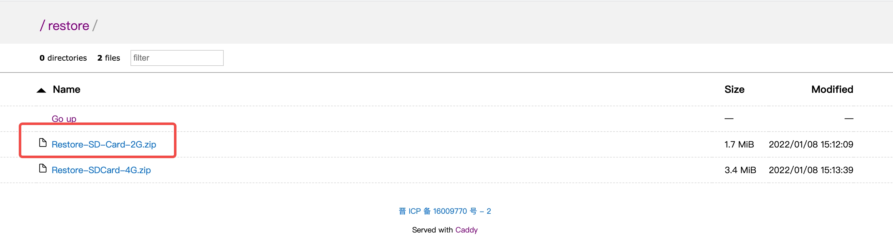
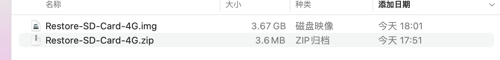
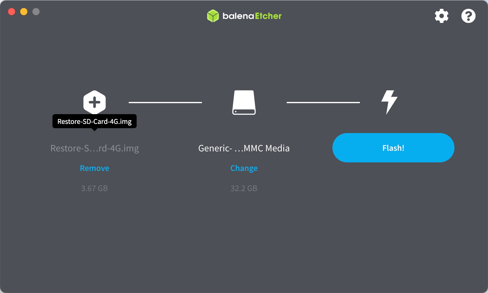
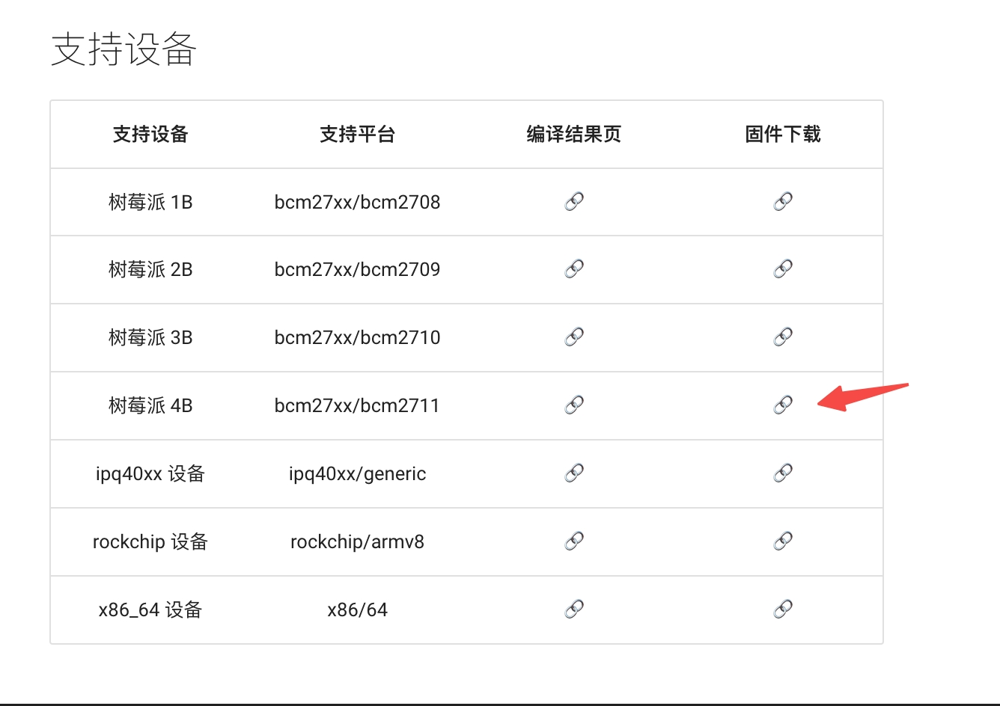
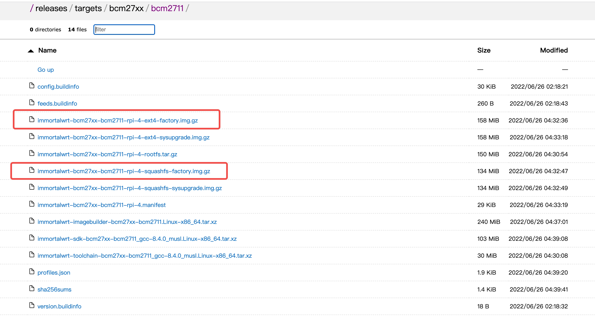
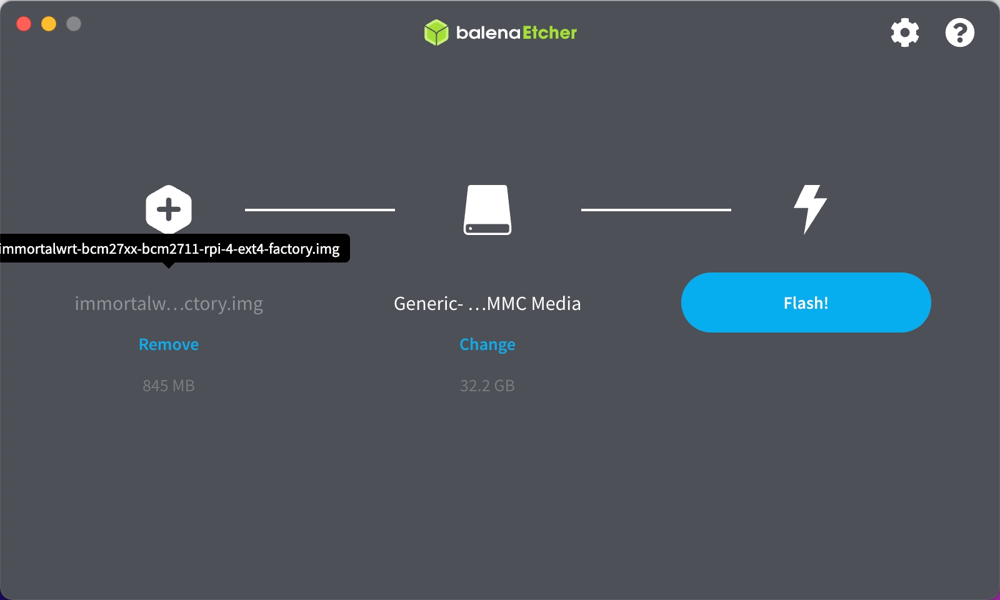
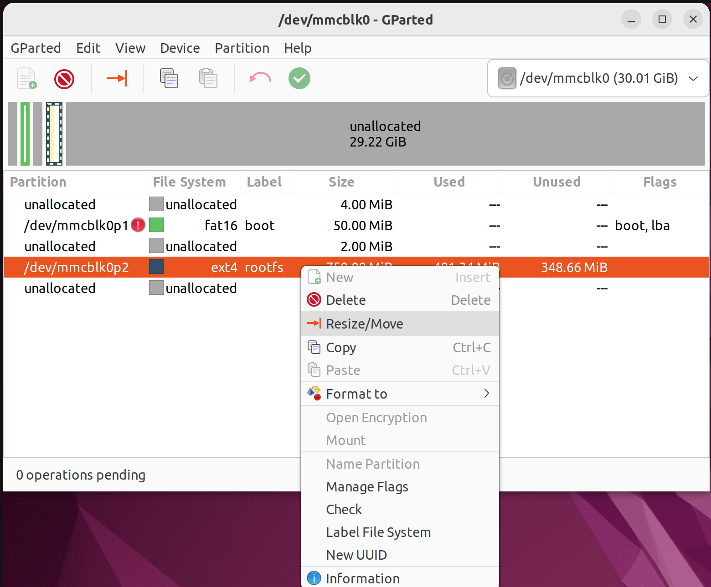
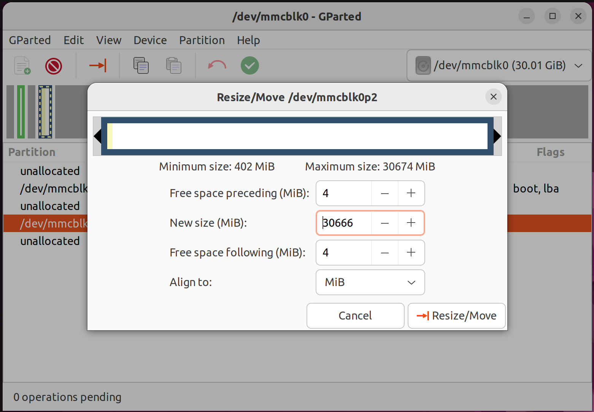
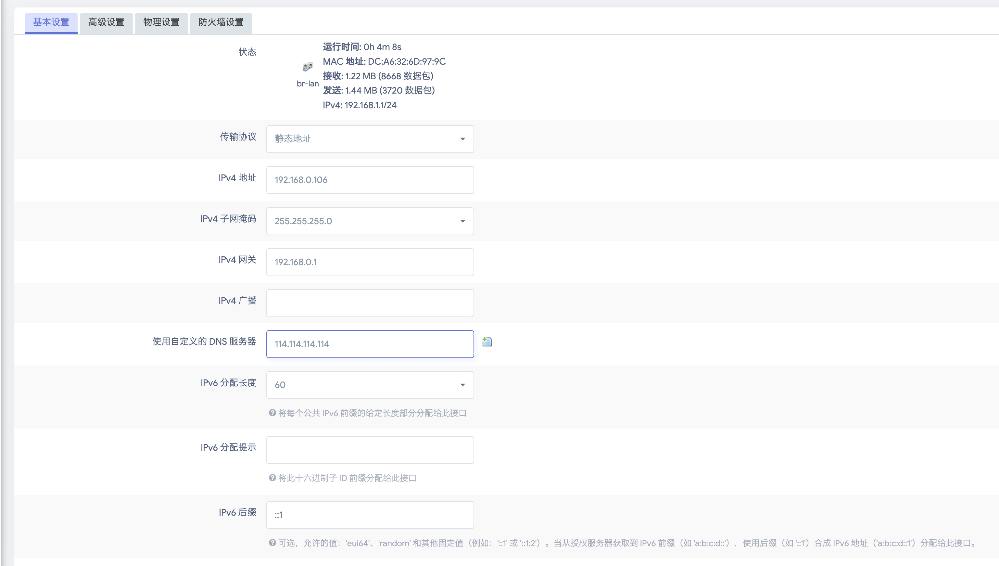
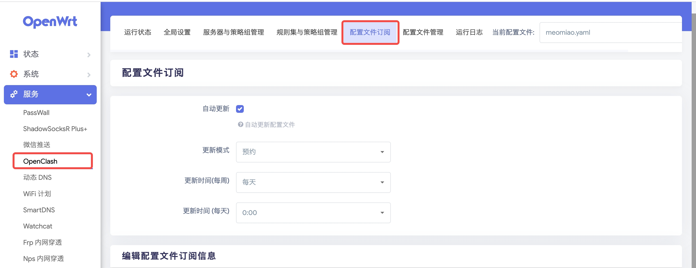

想在电视机上看网飞购入了小米盒子4海外版，小米盒子必须登陆Google账号才能下载安装应用，即使下载了Netflix也需要科学上网才能观看。正好手头有一台闲置的树莓派4b，打算用树莓派跑一个旁路由供电视盒子科学上网。

---

## 准备

1. 一台用于刷镜像&配置软路由的电脑
2. 一个树莓派
3. 一张micro sd卡&读卡器
4. 一条用于连接树莓派与路由器的网线
5. 一个ClashX订阅链接
6. 电脑安装[balenaEtcher](https://www.balena.io/etcher/)用于刷入固件到SD卡

---

## 刷入固件

比较了多个OpenWrt的固件，考虑对树莓配的适配/自带插件/中文支持，本文使用SuLingGG发布的[OpenWrt-Rpi](https://github.com/SuLingGG/OpenWrt-Rpi) 固件。

**以下内容参考自[OpenWrt-Rpi](https://doc.openwrt.cc/) 文档**

### 1. 刷入存储还原固件

在[存储还原固件下载页面](https://openwrt.cc/restore/)下载存储还原固件，4G/2G随便选一个就行



将下载的zip文件解压得到还原固件的镜像文件



使用balenaEtcher将存储还原固件刷入SD卡中



### 2. 刷入OpenWrt固件

在[固件下载页](https://doc.openwrt.cc/2-OpenWrt-Rpi/1-Download/)中根据设备类型选择对应固件。我使用的设备为树莓派4B，进入固件下载页面下载对应的` immortal-xxx-xxx-xxx-factory.img.gz`。下载页中提供`ext4` 与 `squashfs` 两种文件系统的固件，为了便于根目录扩容，我使用的是`ext4`的固件。





与刷入存储还原固件类似，将OpenWrt固件写入SD卡中




### 3. 使用gparted扩容根目录(可选)

默认情况下，openWrt只会将750MiB空间分配给根目录，SD卡中大量存储容量被浪费。可以通过gparted工具移动扩容根目录所在分区。**此步骤需要一台运行Ubuntu/Debian/Fedora操作系统的计算机**, 本文使用Ubuntu22.04。

1. 安装gparted

```sh
sudo apt install gparted
```

2. 将刷入固件的SD卡插入装有gparted的计算机中并打开gparted，右上角物理磁盘切换至SD卡

3. 右键label为rootfs的分区，选择Resize/Move



4. 在Resize/Move页面拖动分区到目标位置与大小，建议在rootfs分区前后段留出大于4MiB空间



5. 提交执行后弹出SD卡

---

## 将树莓派配置为旁路由

将SD卡弹出后插入树莓派中，接通树莓派电源(**此时不要连接路由器LAN口**)。可以发现一个名为OpenWrt的Wifi网络，连接该网络后浏览器输入192.168.1.1便可进入OpenWrt的配置页面，默认用户名为`root`， 默认密码为`password`

### 1. 配置软路由的网络

左侧菜单网络->接口进入接口配置，接口列表点击LAN网络的修改。
- 设置传输协议为`静态地址`
- IPv4地址设置为一个主路由网段中没被使用的地址(本文主路由网络号为192.168.0.0/24，设置为192.168.0.106)
- IPv4子网掩码与主路由网络保持一致(本文主路由网络号为192.168.0.0/24，设置为255.255.255.0)
- IPv4网关设置为主路由的IPv4网关(本文中主路由IP为192.168.0.1)
- 使用自定义的 DNS 服务器设置为`114.114.114.114`
- 其他设置使用默认参数



点击`保存&应用`后使用网线将树莓派连接到主路由的LAN口上，断开OpenWrt Wifi，连接主路由对应网络后便可通过上面配置的IPv4地址进入软路由配置页面

进入主路由管理页面，为树莓派添加IP与MAC地址绑定

### 2. 软路由的一些其他配置

#### 设置wifi密码

进入软路由配置页面，左侧菜单网络->无线，无线网络列表中点击OpenWrt的修改。
接口配置-> 无线安全
- 加密方式设置为 `WPA2-PSK/WPA3-SAE Mixed Mode`
- 设置密码

点击`保存&应用`

#### 设置软路由管理员密码
进入软路由配置页面，左侧菜单系统->管理权，设置管理员密码

## 配置ClashX

一般机场都会提供ClashX订阅链接，如果没有，可以试试这一家[https://portal.meomiao.xyz/#/register?code=OX2WeBQg](https://portal.meomiao.xyz/#/register?code=OX2WeBQg)

1. 进入软路由配置页面，左侧菜单->服务->OpenClash->配置文件订阅。设置自动更新策略



2. 编辑配置文件订阅信息，填入ClashX订阅链接与配置文件名，保存配置


1. 左侧菜单->服务->OpenClash 启动OpenClash

2. curl一下google验证代理服务是否生效

```sh
https_proxy=http://127.0.0.1:7890 http_proxy=http://127.0.0.1:7890 all_proxy=socks5://127.0.0.1:7890 curl www.google.com
```

---

## 设备通过旁路由上网

设备连接上软路由Wifi后，IP设置为静态
- IP地址设置为一个主路由所在网络未被使用的地址
- 网关设置为软路由对应的IP地址(本文中配置为192.168.0.106)
- 网络前缀长度/子网掩码与主路由所在网络一致(本文为24/255.255.255.0)
- DNS地址设置为软路由对应IP(本文中配置为192.168.0.106)
